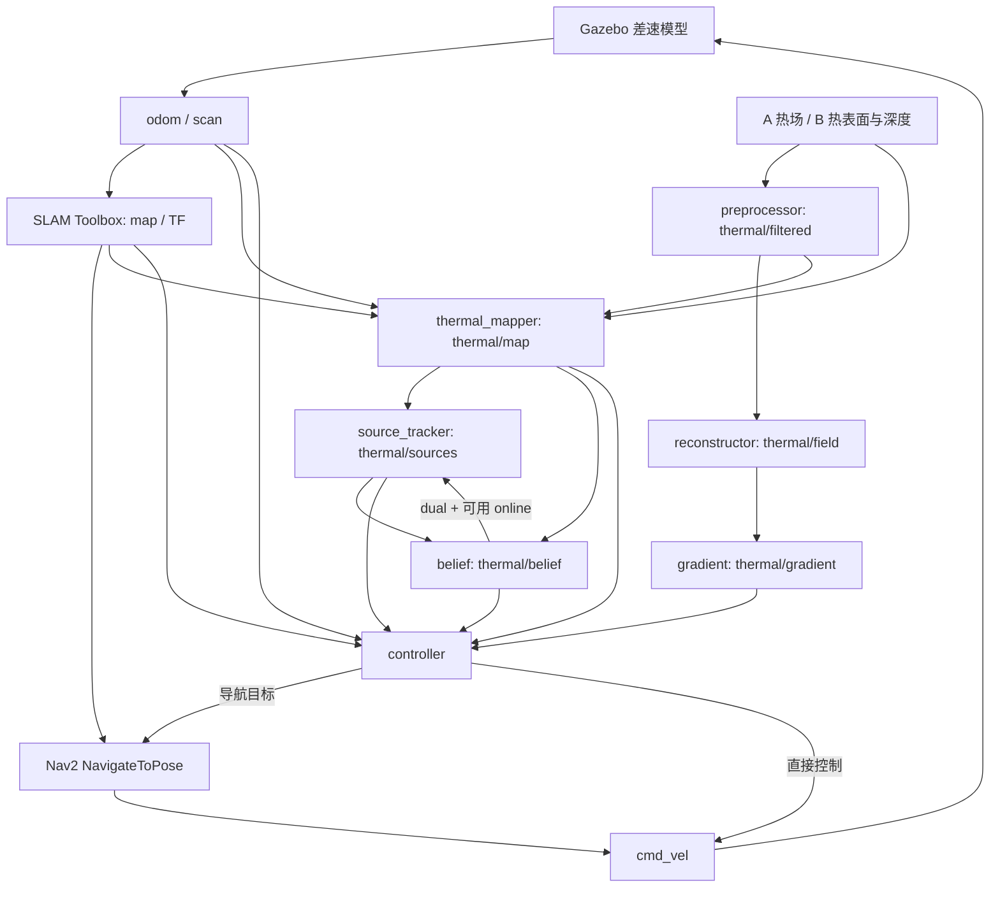

# 接手文档 01 · 架构与数据流

核对日期：2026-09-14。启动入口位于 `src/thermal_robot/thermal_bringup/launch/`。

## 运行数据流

图中名字省略了话题前导 `/`。真值 `/sim/thermal_sources_truth` 只供评测，不能输入跟踪或决策。实机覆盖层用 `/thermal/raw` 替换模拟图像输入，深度由外部提供并配准。

## 主要接口

| 话题/服务 | 类型（包内类型简写） | 生产与消费 |
|---|---|---|
| `/sim/thermal_raw` | sensor_msgs/Image，32FC1 ℃ | 模拟器 → 预处理；A 10 Hz，B 8.6 Hz |
| `/thermal/raw` | sensor_msgs/Image，32FC1 ℃ | radiometric 输入 → UGV 预处理 |
| `/thermal/depth` | sensor_msgs/Image | B 模拟或实机配准 → mapper；投影使用 optical-z 米 |
| `/thermal/camera_info` | sensor_msgs/CameraInfo | 模拟/真实相机 → mapper；实机还供深度配准 |
| `/thermal/filtered` | sensor_msgs/Image | 预处理 → reconstructor、mapper |
| `/thermal/field` | ThermalField | reconstructor → gradient；包含图像场统计与热点 |
| `/thermal/get_field_info` | GetFieldInfo 服务 | 查询 reconstructor 最近场数据 |
| `/thermal/gradient` | GradientArray | gradient → controller；包含实际图像宽高 |
| `/thermal/map` | ThermalMap | mapper → tracker、belief、controller；配置上限 5 Hz |
| `/thermal/sources` | SourceEstimateArray | tracker → belief、controller；Kalman 默认限速 2 Hz |
| `/thermal/belief` | BeliefState | belief → tracker、controller；默认 1 Hz，off 无估计输出 |
| `/odom`、`/scan` | nav_msgs/Odometry、sensor_msgs/LaserScan | 仿真插件或外部底盘 → 热链路/导航 |
| `/map` | nav_msgs/OccupancyGrid | SLAM → mapper/controller/Nav2 |
| `/cmd_vel` | geometry_msgs/Twist | controller 直接控制或 Nav2 → 底盘 |

图像/里程计/雷达使用传感器类 QoS，热地图与估计结果采用可靠传输，SLAM 地图订阅使用持久化 QoS。诊断时用 `ros2 topic info -v` 核查端点，不只看话题是否存在。输出频率受输入、限速和运动状态影响，不保证全部 10 Hz。

`ThermalMap` 保留 `view_state`、`last_seen_age_s`，已没有 `view_sectors`、`last_view_distance_m`。`SourceEstimate` 保留位置/协方差/强度/尺度/置信度/观测数/年龄，已无速度、重捕获字段。`/thermal/clearance` 已删除。

## 坐标与时间

仿真模型出生在 `(-6, 0)`；Gazebo `odometry_source=1` 提供绝对世界位姿。sensor 内部减出生点转换到场景计算所需位移，主 launch 将 mapper/controller 的 `spawn_x/y` 设为零。不要再对 `/odom` 或采集 CSV 中的世界坐标加一次出生点。

热图默认 frame 为 `world`；UGV overlay 使用 `map` 和标定 TF。控制器在发送导航目标和处理占据地图时转换坐标，不能凭 frame 名称假定 `world/map/odom` 数值恒等。世界热图 0.25 m 栅格与 SLAM 占据图是不同对象。

B 深度是 optical-z，不是射线欧氏距离；相机 optical 坐标 x 向右、y 向下、z 向前。实机要求热图、CameraInfo、深度、时间戳及标定 TF 一致；缺少有效深度时不生成该像素的定位证据。表面落点也不必等于物体中心。

主仿真 `use_sim_time=true`，UGV 默认 false，回放加 true。ROS 定时/消息时钟与控制器 `time.monotonic()` 超时并存；改变回放速率或暂停仿真不等于冻结所有策略计时。

## 参数层和启动顺序

仿真各节点按 `params.yaml -> software_params（默认 multisource.yaml）-> launch 内联参数` 覆盖。内联参数决定 A/B 分辨率、速率、预处理，现代策略 Kalman、融合窗口、门控和坐标偏移。`software_params` 替换整个第二层文件，不是在默认文件上追加零散补丁。

UGV 使用 `params.yaml -> multisource.yaml -> hardware_params（默认 ugv_thermal.yaml）-> 对应节点内联参数`。默认 `enable_motion=false`，只启动感知估计；它不创建底盘驱动、SLAM 或 Nav2。

主仿真启动约在 0 秒起 Gazebo/robot_state_publisher，5 秒开 gzclient（可关），6 秒生成机器人，9 秒起 SLAM，12 秒起 Nav2，18 秒起热链路，20 秒起 colorizer/RViz（可关）。这是定时启动安排，不是就绪保证。

Nav2 lifecycle 管理 controller_server、planner_server、behavior_server、bt_navigator；BT XML 由 package share 动态注入。当前 launch 没有独立 waypoint_follower 或 velocity_smoother。控制器与 Nav2 共享速度话题；手动发速度前需停止自主命令源。
