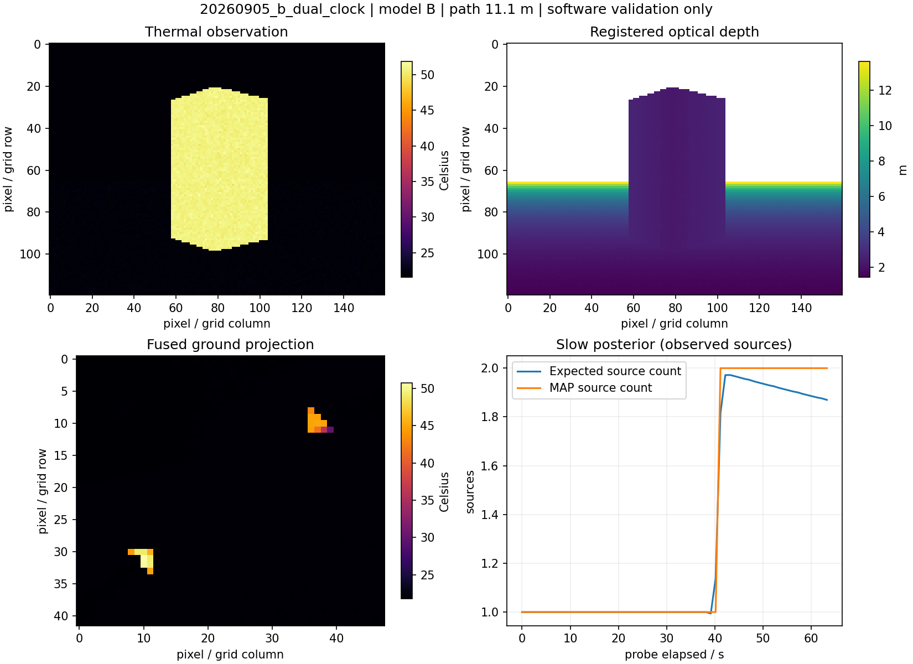

# 软件层交付审计：2026-09-05

本文件记录上一轮软件接口与缩减运行检查，**不能据此断言原规划逐条完成或探测性能达标**。后续审查发现：慢层三档自适应降级尚未实现；完整归因工具仍使用 A 级俯视足迹；新策略采用世界坐标接近控制，与原规划保留 FINE 梯度状态机有偏差；硬件路线按用户准备的 UGV 改为 ROS 覆盖层，没有实现 G1 SDK。原规划的 recall 显著性、precision 下界、ECE 和真实硬件验证也未通过验收。

下面的“完成”是当时模块实现判断，不是研究门槛结论。后续发现的串 ID、漏源与生灭滞后以及修复证据见 [探测修复记录](detection_recovery.md)。历史运行及负面结果保留，不用后续较好结果覆盖。

实现提交：`ef20086`（运动/源簇核心）、`a2ac3ba`（ROS/B 级/硬件覆盖层）、`8ea46bf`（闭环问题修复与降级）。机器可读结果见 [validation_snapshot.json](validation_snapshot.json)，运行方法及接口迁移见 [运行文档](multisource_runtime.md)。

## 逐项证据

| 要求 | 实现与验证证据 | 软件层判定 |
|---|---|---|
| 常速 Kalman、预测关联与动态去重 | `motion_filter.py`、`source_tracking.py`；速度收敛、交叉身份保护、stale 预测、重捕获保留 ID 的测试；B 动态实跑输出速度/年龄 | 完成 |
| 预测重访与探索仲裁 | `revisit.py` 接入控制器目标选择；测试预测只补消息延迟、不可达排除、冷却、公平轮转；障碍生灭源实跑记录重捕获计数 1 | 完成 |
| 默认 Rao-Blackwell 源簇慢层 | `belief.py`：条件运动高斯、幅值/尺度更新、Bernoulli 存在概率与卷积源数 PMF；残差 birth、可见性条件 death、持续 merge、split birth、关联；测试包括五源运动/迟生/消失/重生 | 完成 |
| 慢层模式、时限、异常回退 | `belief_node.py` 独立进程；`runtime_policy.py` 统一拒绝关闭、影子、过期、错误、未来时间及非双层策略；异常输入事务回滚单测、45 次超预算实跑、off/shadow 实跑 | 完成 |
| 后验参与决策与快层先验校正 | 控制器后验熵降/定位收益进入选点；tracker 使用保守协方差交集；online 日志显示采用慢层，shadow/off/超预算日志显示仅快层；fast/GP 禁止慢层回灌 | 完成 |
| 残差/可见性/可达性规划 | 保留阶段 1 模块，修正旋转占据地图与 TF 坐标转换；源接近使用世界坐标，受阻时选择已知空闲停靠点/Nav2，无法到达则暂缓并继续探索；障碍场景复测恢复运动 | 完成 |
| 生成式清场与校准输出 | `clearance.py`：空间 Poisson、条件幅值先验、多扇区联合漏检、观测距离、历史衰减和新生强度，后验版加入未确认簇；幅值共用的联合漏检有独立蒙特卡洛一致性测试；保留可靠性曲线/ECE 工具 | 完成；真实校准未做 |
| B 级三维热表面 | `surface_scene.py`：盒/柱、指定发热面、最近交点、自遮挡/场景遮挡、噪声、偏置/漂移、emissivity、深度噪声/无效值；单测验证遮挡和物理方向 | 完成 |
| B 级与真实仿真几何一致 | 临时 SDF 加入碰撞体，动态更新 Gazebo 实体；off/online 动态场景各 60 次 GetEntityState 抽查，最大位置差约 0.0146 m | 完成 |
| 透视观测契约与 A/B 切换 | `perspective.py`、mapper：光学深度、内参、完整外参、时间配对、测量类型、frame_id；无深度不生成证据；A/B 闭环、旋转占据格和无效值测试 | 完成 |
| 预处理/映射适应相机运动 | B 默认 passthrough，避免像素时间滤波与深度错配；NaN 保留、有限历史融合、置信度加权、扇区过期；热源熄灭后热图融合测试 | 完成 |
| UGV/radiometric 软件接入及回放路径 | `ugv_thermal_launch.py`、radiometric/depth registration 节点；真实 ROS 覆盖层接受合成带行填充的大端 TLinear/mm-depth、CameraInfo/TF，验证 59.85°C、3 m、map 投影、单源确认、默认无运动消息 | 完成；实机未做 |
| GP-UCB 和缩减对比/消融入口 | 有界 GP 拟合/不确定度/可达性单测；GP 真实选点日志和 60 s 闭环；与 A 双层受控用例同场景/seed；原策略及矩阵入口保留，新策略已加入 | 完成 |
| 数据、图表、工程检查与交付 | probe 保存源速度/年龄/重捕获、PMF、健康、时间、图像/地图；独立绘图脚本；173 项测试、8 包分两步构建、rosdep、56 对源码/install 一致性检查 | 完成 |

上述源码均位于 `src/thermal_robot/` 对应包；测试集中于 `tests/test_multisource_motion.py`、`test_surface_observation.py`，既有 phase 0/1 与系统测试也保留并通过。运行时跟踪、信念、规划与映射节点没有订阅热源真值；真值只进入模拟器与评测 probe。

## 缩减闭环结果

以下目录均位于 `bags/software_validation/`。时长为启动预热后的 probe 采样时间；确认 ID 数为采样期间出现的 confirmed 标签数，不是配对真值 recall。场景与 seed、当时源码指纹均保存在各目录 `run.json`，不能把迭代期间的不同运行当成严格性能比较。

| 目录 | 覆盖内容 | 采样时长 | 实际路径 | 确认 ID 数 | 慢层状态 |
|---|---|---:|---:|---:|---|
| `20260905_a_contract_online` | A 受控多源确认/重访闭环 | 60 s | 6.49 m | 1 | 59 次 ready，控制采用后验 |
| `20260905_b_dual_clock` | B 静态双源、完整热图/深度链 | 65 s | 11.12 m | 2 | 64 次 ready |
| `20260905_b_timeout_final` | B，慢层预算注入 0.001 ms | 45 s | 7.84 m | 2 | 45 次 over_budget，控制全程仅快层 |
| `20260905_b_obstacle_recovery` | B，障碍与出现/消失源，shadow | 80 s | 12.43 m | 3 | 79 次 ready，控制全程仅快层 |
| `20260905_b_off_dynamic_final` | B，动态物体，关闭慢层 | 60 s | 10.23 m | 2 | 无慢层输出，控制持续运行 |
| `20260905_gp_ucb_final` | A，GP-UCB，与 A 受控用例同 seed | 60 s | 5.53 m | 1 | off，实际调用 GP 选点 |
| `20260905_dual_final` | 最终实现：B、动态物体、online | 60 s | 9.92 m | 2 | 60 次 ready，39 条采用后验的健康报告 |

最终 B online：快层更新（含消息处理/发布）最大 2.15 ms，规划最大 12.5 ms，慢层 p99 约 2.65 ms。B off 动态的最新检测定位误差诊断 p95 约 0.274 m，最终 online 约 0.286 m；都是最近物理源距离，不是多目标配对评价。Pi 5 尚未测量，本机这些结果不构成 Pi 5 算力保证。

硬件覆盖层检查：`20260905_hardware_final/result.json`。热源投影中心为 `(4.125, 2.0)`，与理论位置 `(4.0, 2.0)` 的差来自 0.25 m 栅格中心量化；完整 TF 转换、温度/深度单位和无效像素已检查。

工程检查原始输出在 `20260905_checks/`：`pytest.log`（173 passed）、`interfaces_build.log`（接口包）、`runtime_build.log`（7 个运行包）、`rosdep.log`。最终源码/install 检查为 56 对、0 不一致。

## 明确保留的边界

1. **工程功能交付不等于原研究门槛通过。** 未重跑全量矩阵、全套消融、退化扫描和显著性/置信区间门槛；没有证明新系统全面优于 v31、纯 frontier/Levy 或 GP。原阶段 1 的失败研究结果没有被本次替换。
2. **清场输出默认未校准。** `clearance_calibrated=false`，不凭该概率自动结束任务。蒙特卡洛测试证明实现与指定模型一致，不证明现实探测率符合模型。
3. **动态存在性有滞后。** 热源停止发热或离开视野后，confirmed/stale 轨迹按生命周期保留并预测；因此拿它与“当前仍发热源”的最近距离可能得到很大的数值。日志保留这种现象；最新检测位置误差另行统计，不能把两者混为定位精度或宣称零误报。
4. **Nav2 仍可能停滞。** 本轮提供并验证停滞回退、扫描保护和受阻源暂缓，未承诺所有障碍布局均可达。既有 Gazebo `odometry_source` 警告和偶发 Nav2 取消/退出警告仍保留，未将退出日志当成运行成功依据。
5. **B 级是规定范围的近似传感器。** 灰体 T⁴ 混合不是完整长波红外反射/热传导；只支持本项目的盒/柱碰撞几何，不能冒充任意三维网格渲染器。信念 A/σ 是地面投影强度/范围，不是空气温度场的实机测量。
6. **实机与外设边界。** UGV 厂商驱动/Nav2/TF、实际热相机固件及 TLinear 标定、已标定深度、Pi 5 性能由负责人验证。Lepton/PT3 本身没有深度，本软件实现深度配准路线，未实现无深度三角化；未做 UGV 驱动或 G1 SDK 的实际硬件联调。

失败或中间运行目录保留作诊断，未计入通过集合：早期 A 原地停滞、B 伪热源、关闭模式字符串类型错误、并发 Gazebo master 冲突等均已定位并修复。`20260905_a_dynamic_final` 有实际确认与约 10 m 位移，但旧 probe 错把低频清场消息判为停止，因此该目录不列入通过集合。
